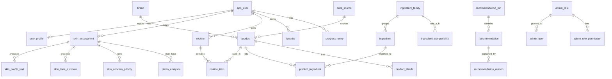

# Database design (Phase 2)

Engine: PostgreSQL 16 locally (Docker). Production target: Supabase Postgres (verify version at deploy time).
Migrations live in `database/migrations`, seeds in `database/seeds`, checks in `database/tests`.

## Key design decisions

| Decision | Why |
|---|---|
| Skin traits are **rows** (`skin_profile_trait`), not columns | A person can be oily + dehydrated + sensitive; each trait has its own score, confidence, source and evidence |
| Trait sources: `quiz`, `photo`, `combined`, `user_override` | Keeps raw signals separate; `effective_skin_trait` view picks override > combined > quiz > photo |
| `answers` stored as JSON on `skin_assessment` | Results can be re-computed when rules change |
| Lookup tables (`skin_concern`, `product_category`) | One source of truth for allowed values, referenced by foreign keys |
| Compatibility rules between **ingredient families** | One rule ("AHA + retinoid") covers every ingredient in the family; pairs stored once with `family_a_id <= family_b_id` |
| `NULL` = unknown (e.g. `fragrance_free`, price) | We never guess; the UI shows "unknown" |
| Every product, shade and ingredient links to a `data_source` | Provenance + licence tracking, including a `share_alike` flag for ODbL data |
| `product_ingredient.raw_name` kept even if unmatched | Nothing lost during ingredient normalization; unmatched ones appear in `data_quality_issue` |
| Recommendations stored as runs with engine + rules version | Reproducible and explainable history |
| Photos: metrics by default, `storage_path` only with consent | Privacy by design |
| `audit_log` has no FK to users and blocks UPDATE/DELETE | Append-only; account deletion never needs to touch it |
| `analytics_event` has no user/session id | Anonymous by construction |
| Passwords are not in our schema | Handled by Supabase Auth; `app_user.id` = auth user id |
| 18+ only (`age_group` starts at 18_24) | Avoids minors' data handling for the MVP |

## Account deletion

`DELETE FROM app_user WHERE id = $1` cascades to profile, restrictions, consents, assessments, traits,
photo metrics, routines, recommendations, favourites, progress, subscription, feedback.
**The API must delete stored photo files from storage first** (the database only stores the path).

## Entity relationships (summary)

## Not in the schema yet (by design)

- Ingredient knowledge, compatibility rules, products, articles: need real sources (Phases 7-8).
- Row-Level Security policies: `database/supabase/0001_deny_by_default_rls.sql` denies direct access; the API is the gatekeeper.
- Price-tier thresholds and the 1-10 depth-bin definition: defined in Phases 8 and 10.

## How to verify

`npm run db:reset` then `npm run db:test`. Expect 12 PASS lines and `ALL SCHEMA CHECKS PASSED`.
